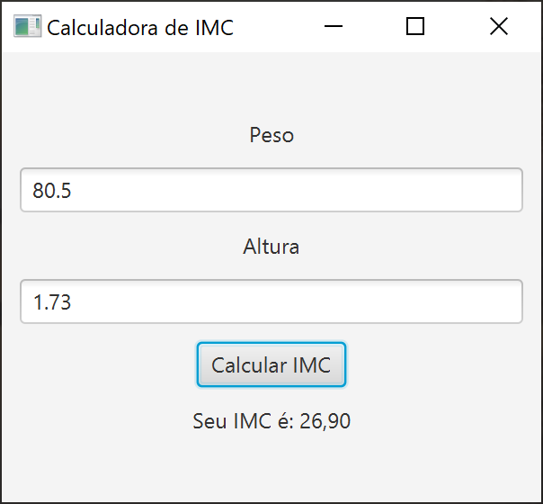

# Projeto Calculadora de IMC

## Description
Este projeto foi desenvolvido seguindo o curso: Java 22: Aprenda POO + Componentes Gráficos + Projetos Incríveis para Iniciantes. Tudo ensinado com Amor!, do Professor Eng. Arnaldo Souza.

### Tabela de classificação de IMC

| IMC (kg/m²) | Classificação |
| ---------  |------------------------|
| Abaixo de 17 |    Muito abaixo do peso |
| 17 - 18,49 |          Abaixo do peso |
| 18,5 - 24,99 |             Peso normal |
| 25 - 29,99 |           Acima do peso |
| 30 - 34,99 |             Obesidade I |
| 35 - 39,99 |   Obesidade II (severa) |
| Acima de 40 | Obesidade III (mórbida) |

Formula: IMC = Peso / Altura2

## Tools and Technologies
- Java v22;
- JavaFX;
- CSS

